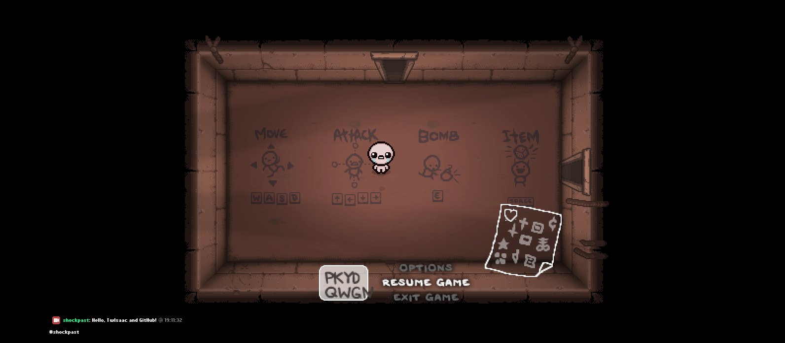

# TwIsaac

Twitch Chat, but inside of Isaac, isn't it awesome?

> [!WARNING]
> TwIsaac requires `--luadebug` flag in launch options, since it uses `luasocket` to connect to Twitch Chat.

# Feature
- You can read messages that people send in your/someone's chat!
- And even reply to them, using console commands, wow!

# Installation
1. [Download](https://github.com/shockpast/twisaac/releases/latest) and extract the contents into `<game_installation>/mods/`
2. Open `twisaac/config.example.lua` and replace `token`, `username` and `channel` variables with your own (instructions are inside of the file)
3. Rename `config.example.lua` to `config.lua`
4. Start a New Game!

# Commands

### twisaac_say
Sends a message to Twitch.

- Arguments: `string message`
- Usage: `twisaac_say Hello, World!`

### twisaac_reply
Replies to specific message from current chat hud.

- Arguments: `number message_index`, `string message`
- Usage: `twisaac_reply 1 Hello, shockpast!`
